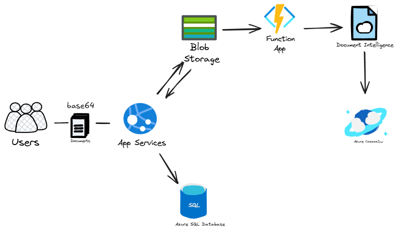

# SISTEMA DE PROCESACIMIENTO DE FACTURAS CON INTELIGENCIA ARTIFICIAL
Esta aplicación recibe archivos desde distintos clientes (web, móvil, etc.), los convierte a PDF o imagen, los almacena en Azure Blob Storage, registra la metadata en Azure SQL Database, procesa el documento con Document Intelligence y finalmente guarda los resultados en Azure Cosmos DB.

## Arquitectura de Aplicacion


## Flujo
- Users (clientes web/móvil) envían archivos en Base64.
- App Service recibe el archivo, lo convierte a PDF/imagen y lo guarda en Blob Storage.
- App Service registra la URL del blob en Azure SQL Database.
- Cuando el archivo entra a Blob Storage, se dispara la Function App (BlobTrigger).
- La Function genera un SAS Token y llama a Document Intelligence.
- Document Intelligence procesa el archivo y devuelve la información estructurada.
- Los resultados procesados se guardan en Cosmos DB para consultas y análisis.
- 
## Funciones principales:

-  Carga de facturas y almacenamiento seguro en la nube
   
- Procesamiento automatizado con IA para extraer campos como fecha, total, impuestos, etc.
   
- Consulta de facturas procesadas mediante API REST
   
- Integración completa con el ecosistema de Azure

## Tecnologías Usadas

Lista de las principales tecnologías o herramientas utilizadas en el proyecto:
- Azure Blob Storage
- Azure Functions
- Azure Cognitive Services
- Azure SQL
- Azure App Services
- Python 3.11
- Flask
- dotenv para manejo de variables de entorno
- Otros...


## Requisitos

Asegúrate de que los usuarios tengan instalados los siguientes requisitos para ejecutar el proyecto:

- Python 3.9+
- Pip
- Acceso a una cuenta de Azure y una subscripcion de azure 
- Un archivo `.env.example` con las configuraciones necesarias (explicado más abajo)

## Instalación

1. Clona este repositorio:
   ```bash
   git clone https://github.com/EynerDev/invoicesDocumentIntelligence.git

2.Intala las dependencias
  ```bash
  pip install requirements.txt


  
